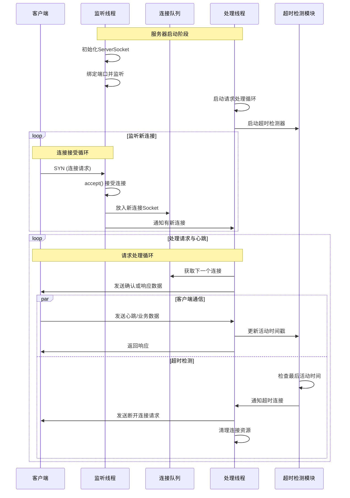

```mermaid
sequenceDiagram
    participant Client as 客户端
    participant ListenThread as 监听线程
    participant Queue as 连接队列
    participant HandleThread as 处理线程
    participant TimeChecker as 超时检测模块

    Note over ListenThread, HandleThread: 服务器启动阶段
    ListenThread->>ListenThread: 初始化ServerSocket
    ListenThread->>ListenThread: 绑定端口并监听
    HandleThread->>HandleThread: 启动请求处理循环
    HandleThread->>TimeChecker: 启动超时检测器

    loop 监听新连接
        Note over ListenThread, Client: 连接接受循环
        Client->>ListenThread: SYN (连接请求)
        ListenThread->>ListenThread: accept() 接受连接
        ListenThread->>Queue: 放入新连接Socket
        ListenThread->>HandleThread: 通知有新连接
    end

    loop 处理请求与心跳
        Note over HandleThread, Client: 请求处理循环
        HandleThread->>Queue: 获取下一个连接
        HandleThread->>Client: 发送确认或响应数据
        
        par 客户端通信
            Client->>HandleThread: 发送心跳/业务数据
            HandleThread->>TimeChecker: 更新活动时间戳
            HandleThread->>Client: 返回响应
        and 超时检测
            TimeChecker->>TimeChecker: 检查最后活动时间
            TimeChecker->>HandleThread: 通知超时连接
            HandleThread->>Client: 发送断开连接请求
            HandleThread->>HandleThread: 清理连接资源
        end
    end
```