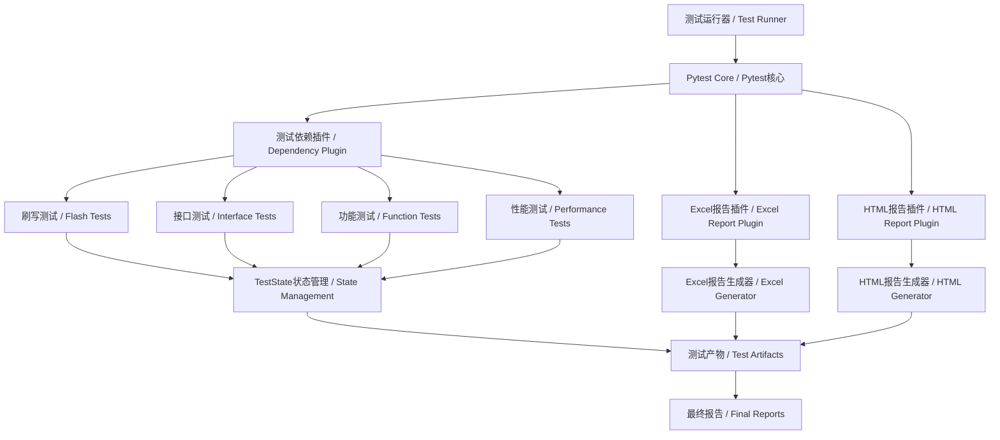
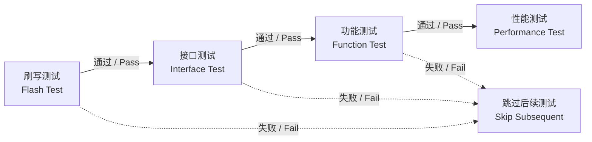
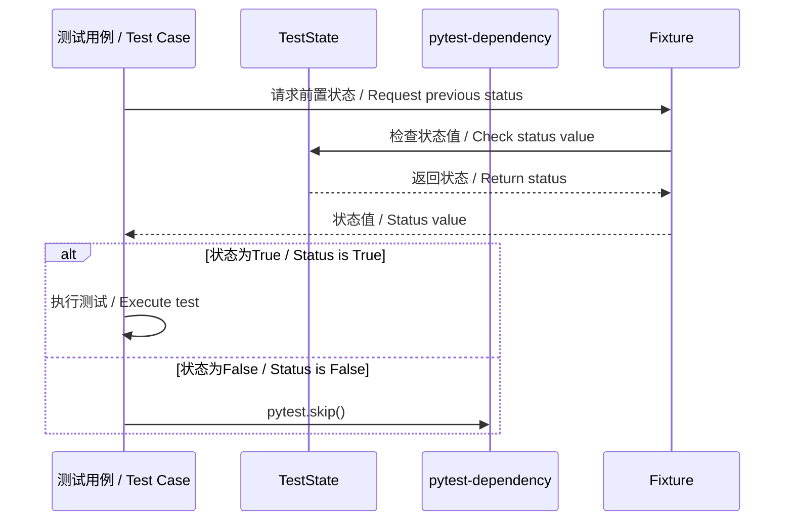
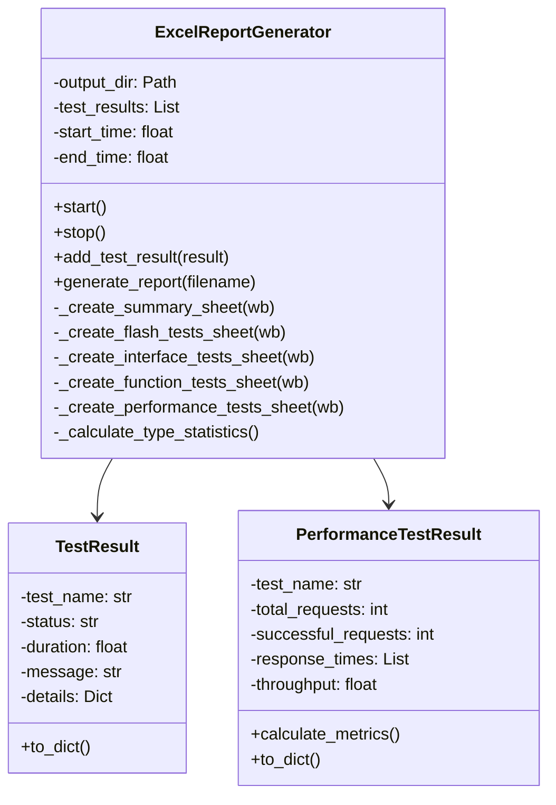
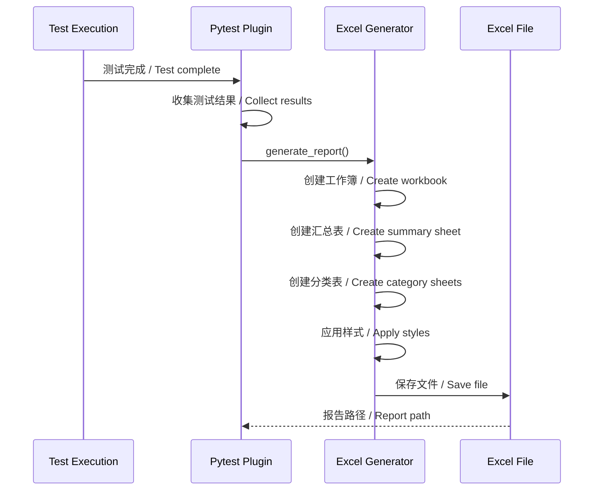
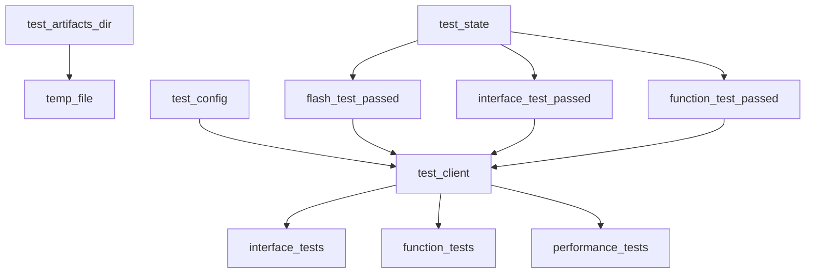
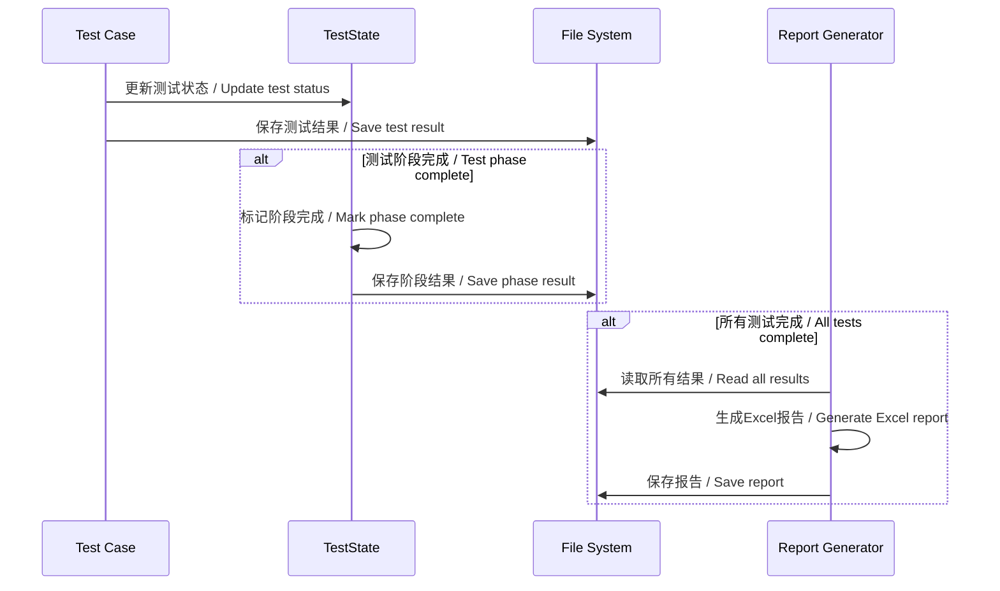

# Pytest测试框架设计文档 / Pytest Test Framework Design Document

## 目录 / Table of Contents

1. [概述 / Overview](#概述--overview)
2. [架构设计 / Architecture Design](#架构设计--architecture-design)
3. [测试依赖机制 / Test Dependency Mechanism](#测试依赖机制--test-dependency-mechanism)
4. [测试类型与分类 / Test Types and Categories](#测试类型与分类--test-types-and-categories)
5. [报告生成系统 / Report Generation System](#报告生成系统--report-generation-system)
6. [Fixture设计 / Fixture Design](#fixture设计--fixture-design)
7. [测试数据管理 / Test Data Management](#测试数据管理--test-data-management)
8. [扩展性设计 / Extensibility Design](#扩展性设计--extensibility-design)
9. [性能优化 / Performance Optimization](#性能优化--performance-optimization)
10. [最佳实践 / Best Practices](#最佳实践--best-practices)

---

## 概述 / Overview

### 设计目标 / Design Goals

1. **测试依赖自动化**: 实现刷写→接口→功能→性能的自动依赖链
2. **多格式报告支持**: 生成HTML、Excel格式的详细测试报告
3. **高可维护性**: 清晰的代码结构和模块化设计
4. **高覆盖率**: 目标测试覆盖率≥95%
5. **快速执行**: 支持并行测试执行和增量测试

### 技术栈 / Technology Stack

| 组件 / Component | 技术 / Technology | 版本 / Version |
|----------------|------------------|---------------|
| 测试框架 / Test Framework | pytest | ≥8.0.0 |
| 依赖管理 / Dependency Management | pytest-dependency | ≥0.6.0 |
| HTML报告 / HTML Report | pytest-html | ≥4.0.0 |
| Excel报告 / Excel Report | openpyxl | ≥3.1.0 |
| 覆盖率 / Coverage | pytest-cov | ≥5.0.0 |
| 并行执行 / Parallel Execution | pytest-xdist | ≥3.5.0 |
| 超时控制 / Timeout Control | pytest-timeout | ≥2.3.0 |

---

## 架构设计 / Architecture Design

### 系统架构图 / System Architecture Diagram



### 目录结构 / Directory Structure

```
pytest-viu-design/
├── src/                                    # 源代码 / Source Code
│   ├── client.py                          # TCP客户端 / TCP Client
│   ├── server.py                          # TCP服务器 / TCP Server
│   ├── log.py                             # 日志配置 / Logging Config
│   ├── excel_report.py                    # Excel报告生成器 / Excel Generator
│   └── pytest_excel_report.py             # Pytest插件 / Pytest Plugin
├── tests/                                 # 测试目录 / Tests Directory
│   ├── conftest.py                       # 全局配置 / Global Config
│   ├── common/                            # 公共工具 / Common Utilities
│   │   └── common.py
│   ├── flash_tests/                       # 刷写测试 / Flash Tests
│   │   ├── __init__.py
│   │   ├── conftest.py
│   │   └── test_flash.py
│   ├── interface_tests/                   # 接口测试 / Interface Tests
│   │   ├── __init__.py
│   │   ├── conftest.py
│   │   ├── common/
│   │   │   └── common.py
│   │   └── test_interface.py
│   ├── function_tests/                    # 功能测试 / Function Tests
│   │   ├── __init__.py
│   │   ├── conftest.py
│   │   ├── common/
│   │   │   └── common.py
│   │   └── test_function.py
│   └── performance_tests/                 # 性能测试 / Performance Tests
│       ├── __init__.py
│       ├── conftest.py
│       ├── common/
│       │   └── common.py
│       └── test_performance.py
├── configs/                               # 配置文件 / Configuration
│   └── config.json
├── test_artifacts/                        # 测试产物 / Test Artifacts
├── pytest.ini                             # Pytest配置
├── requirements.txt                        # Python依赖
├── run_tests.py                           # 测试运行脚本
└── docs/                                  # 文档 / Documentation
    ├── 架构设计.md
    ├── pytest测试设计.md
    └── 快速开始.md
```

---

## 测试依赖机制 / Test Dependency Mechanism

### 依赖链设计 / Dependency Chain Design



### 实现方式 / Implementation

#### 1. pytest-dependency标记

```python
# 定义依赖关系 / Define dependency
@pytest.mark.flash
@pytest.mark.dependency(name="test_flash_complete")
def test_flash_complete(test_state):
    """刷写测试完成 / Flash test complete"""
    test_state.mark_flash_passed()  # 标记状态 / Mark status

# 依赖前置测试 / Depend on previous test
@pytest.mark.interface
@pytest.mark.dependency(name="test_interface_start", depends=["test_flash_complete"])
def test_interface_start(test_state, flash_test_passed):
    """接口测试，依赖刷写 / Interface test depends on flash"""
    if not flash_test_passed:
        pytest.skip("Flash test has not passed yet / 刷写测试未通过")
```

#### 2. TestState状态管理

```python
class TestState:
    """测试状态管理器 / Test state manager"""

    def __init__(self):
        self.flash_test_passed = False
        self.interface_test_passed = False
        self.function_test_passed = False
        self.performance_test_passed = False

    def mark_flash_passed(self):
        self.flash_test_passed = True

    def mark_interface_passed(self):
        self.interface_test_passed = True

    def mark_function_passed(self):
        self.function_test_passed = True

    def mark_performance_passed(self):
        self.performance_test_passed = True
```

#### 3. Fixture注入

```python
@pytest.fixture(scope="session")
def test_state():
    """会话级状态fixture / Session-level state fixture"""
    return TestState()

@pytest.fixture(scope="session")
def flash_test_passed(test_state):
    """检查刷写测试状态 / Check flash test status"""
    return test_state.flash_test_passed

@pytest.fixture(scope="session")
def interface_test_passed(test_state):
    """检查接口测试状态 / Check interface test status"""
    return test_state.interface_test_passed
```

### 依赖检查流程 / Dependency Check Flow



### 依赖矩阵 / Dependency Matrix

| 测试阶段 / Test Phase | 前置依赖 / Prerequisite | 检查点 / Check Point |
|---------------------|----------------------|-------------------|
| 刷写测试 / Flash | 无 / None | 无 / None |
| 接口测试 / Interface | test_flash_complete | flash_test_passed |
| 功能测试 / Function | test_interface_complete | interface_test_passed |
| 性能测试 / Performance | test_function_complete | function_test_passed |

---

## 测试类型与分类 / Test Types and Categories

### 1. 刷写测试 / Flash Tests

#### 测试目标 / Test Objectives

- 验证固件刷写功能完整性
- 确保刷写后系统可用性
- 验证刷写数据完整性

#### 测试用例 / Test Cases

| 用例名称 / Test Name | 描述 / Description | 依赖 / Dependency |
|-------------------|-------------------|-----------------|
| test_flash_connection | 测试刷写连接 / Test flash connection | 无 / None |
| test_flash_prepare | 测试刷写准备 / Test flash preparation | test_flash_connection |
| test_flash_upload | 测试固件上传 / Test firmware upload | test_flash_prepare |
| test_flash_verify | 测试数据验证 / Test data verification | test_flash_upload |
| test_flash_complete | 标记测试完成 / Mark test complete | test_flash_verify |

#### 示例代码 / Example Code

```python
class TestFlash:
    """刷写测试类 / Flash test class"""

    @pytest.mark.flash
    @pytest.mark.dependency(name="test_flash_connection")
    def test_flash_connection(self, test_state, test_config):
        """测试刷写连接 / Test flash connection"""
        from client import Client

        client = Client(
            test_config.get('host', 'localhost'),
            test_config.get('port', 8080),
            test_config.get('token', 'your-secure-token-here')
        )

        try:
            assert client.connected, "连接应该建立 / Connection should be established"

            # 发送状态请求验证通信
            request = {
                "type": "request",
                "command": "get_status",
                "id": 1,
                "token": test_config.get('token', 'your-secure-token-here')
            }
            success = client.send(request)
            assert success, "应该能够发送请求 / Should be able to send request"

        finally:
            client.close()

    @pytest.mark.flash
    @pytest.mark.dependency(depends=["test_flash_connection"], name="test_flash_complete")
    def test_flash_complete(self, test_state, test_artifacts_dir):
        """标记刷写测试完成 / Mark flash test complete"""
        import json
        import time

        test_state.mark_flash_passed()

        # 保存测试结果
        result = {
            "test_type": "flash",
            "status": "passed",
            "timestamp": time.time(),
            "flash_version": "1.0.0"
        }

        result_file = test_artifacts_dir / "flash_test_result.json"
        with open(result_file, 'w', encoding='utf-8') as f:
            json.dump(result, f, ensure_ascii=False, indent=2)
```

### 2. 接口测试 / Interface Tests

#### 测试目标 / Test Objectives

- 验证所有系统接口功能
- 测试接口响应时间
- 验证接口数据格式
- 测试错误处理机制

#### 测试用例 / Test Cases

| 用例名称 / Test Name | 描述 / Description | 接口 / Interface |
|-------------------|-------------------|-----------------|
| test_interface_get_status | 测试获取状态接口 / Test get_status interface | get_status |
| test_interface_health_check | 测试健康检查接口 / Test health_check interface | health_check |
| test_interface_echo | 测试回显接口 / Test echo interface | echo_with_timestamp |
| test_interface_batch_requests | 测试批量请求 / Test batch requests | All interfaces |
| test_interface_latency | 测试接口延迟 / Test interface latency | All interfaces |

#### 示例代码 / Example Code

```python
class TestInterface:
    """接口测试类 / Interface test class"""

    @pytest.mark.interface
    @pytest.mark.dependency(name="test_interface_get_status", depends=["test_flash_complete"])
    def test_interface_get_status(self, test_state, test_client, flash_test_passed):
        """测试get_status接口 / Test get_status interface"""
        if not flash_test_passed:
            pytest.skip("Flash test has not passed yet / 刷写测试未通过")

        from ..common.common import (
            send_and_receive,
            validate_response_structure,
            validate_response_status
        )

        request = {
            "type": "request",
            "command": "get_status",
            "id": 1,
            "token": test_client.token
        }

        response = send_and_receive(test_client, request, timeout=10.0)

        # 验证结构
        expected_fields = ["type", "id", "status", "server_time", "connections"]
        assert validate_response_structure(response, expected_fields)

        # 验证状态
        assert validate_response_status(response, "ok")

        # 验证连接数
        assert isinstance(response.get('connections'), int)
```

### 3. 功能测试 / Function Tests

#### 测试目标 / Test Objectives

- 验证系统功能完整性
- 测试连接生命周期
- 验证消息顺序
- 测试错误恢复能力
- 验证数据完整性

#### 测试场景 / Test Scenarios

| 场景 / Scenario | 描述 / Description | 测试点 / Test Points |
|---------------|-------------------|-------------------|
| connection_lifecycle | 连接生命周期管理 / Connection lifecycle | 连接/断开/重连 |
| message_sequence | 消息顺序验证 / Message sequence | 多消息顺序 |
| error_recovery | 错误恢复 / Error recovery | 错误后恢复 |
| data_integrity | 数据完整性 / Data integrity | 数据校验 |
| multiple_clients | 多客户端 / Multiple clients | 并发连接 |

#### 示例代码 / Example Code

```python
class TestFunction:
    """功能测试类 / Function test class"""

    @pytest.mark.function
    @pytest.mark.dependency(name="test_function_connection_lifecycle", depends=["test_interface_complete"])
    def test_function_connection_lifecycle(self, test_state, test_client, interface_test_passed):
        """测试连接生命周期 / Test connection lifecycle"""
        if not interface_test_passed:
            pytest.skip("Interface test has not passed yet / 接口测试未通过")

        from ..common.common import test_connection_lifecycle

        result = test_connection_lifecycle(test_client)
        assert result, "连接生命周期测试应该通过 / Connection lifecycle test should pass"
```

### 4. 性能测试 / Performance Tests

#### 测试目标 / Test Objectives

- 测量请求延迟
- 测量系统吞吐量
- 测试并发性能
- 进行压力测试

#### 性能指标 / Performance Metrics

| 指标 / Metric | 目标值 / Target | 测试方法 / Test Method |
|--------------|---------------|---------------------|
| P50延迟 / P50 Latency | < 0.1s | 多次请求测量 |
| P95延迟 / P95 Latency | < 0.5s | 多次请求测量 |
| P99延迟 / P99 Latency | < 1.0s | 多次请求测量 |
| 吞吐量 / Throughput | > 20 RPS | 持续请求 |
| 并发连接 / Concurrent Connections | 10 clients | 并发测试 |
| 压力测试 / Stress Test | 1000 requests | 长时间高负载 |

#### 示例代码 / Example Code

```python
class TestPerformance:
    """性能测试类 / Performance test class"""

    @pytest.mark.performance
    @pytest.mark.dependency(name="test_performance_latency", depends=["test_function_complete"])
    def test_performance_latency(self, test_state, test_client, function_test_passed):
        """测试请求延迟 / Test request latency"""
        if not function_test_passed:
            pytest.skip("Function test has not passed yet / 功能测试未通过")

        from ..common.common import measure_latency, PerformanceTestResult

        request = {
            "type": "request",
            "command": "health_check",
            "token": test_client.token
        }

        result = measure_latency(test_client, request, iterations=30)
        result.calculate_metrics()

        # 验证P95延迟
        assert result.percentiles.get('p95', 0) < 1.0, \
            f"P95延迟应小于1.0s / P95 latency should be < 1.0s, got: {result.percentiles.get('p95', 0):.3f}s"
```

---

## 报告生成系统 / Report Generation System

### 报告类型 / Report Types

#### 1. HTML报告 / HTML Report

使用 `pytest-html` 插件生成，特点：

- 实时查看测试进度
- 详细的错误堆栈
- 美观的界面设计

```bash
pytest tests/ --html=test_artifacts/report.html --self-contained-html
```

#### 2. Excel报告 / Excel Report

使用 `openpyxl` 库生成，包含5个工作表：

| 工作表 / Sheet | 内容 / Content |
|--------------|--------------|
| 测试汇总 / Summary | 整体统计信息 / Overall statistics |
| 刷写测试 / Flash | 刷写测试详情 / Flash test details |
| 接口测试 / Interface | 接口测试详情 / Interface test details |
| 功能测试 / Function | 功能测试详情 / Function test details |
| 性能测试 / Performance | 性能测试详情 / Performance test details |

### Excel报告架构 / Excel Report Architecture



### 报告样式 / Report Styling

#### 颜色方案 / Color Scheme

| 状态 / Status | 背景色 / Background Color | 用途 / Usage |
|-------------|-------------------------|-------------|
| 标题 / Title | #4472C4 (蓝色 / Blue) | 主要标题 / Main title |
| 表头 / Header | #D9E1F2 (浅蓝 / Light Blue) | 列标题 / Column headers |
| 通过 / Passed | #C6EFCE (浅绿 / Light Green) | 测试通过标记 / Pass marker |
| 失败 / Failed | #FFC7CE (浅红 / Light Red) | 测试失败标记 / Fail marker |

#### 字体设置 / Font Settings

```python
title_font = Font(name='微软雅黑', size=14, bold=True)
header_font = Font(name='微软雅黑', size=11, bold=True)
cell_font = Font(name='微软雅黑', size=10)
```

### 报告生成流程 / Report Generation Flow



---

## Fixture设计 / Fixture Design

### Fixture层次结构 / Fixture Hierarchy

```
pytest fixtures / pytest fixtures
├── 自动执行 / Auto-use Fixtures
│   └── log_test_start (autouse)
│
├── 会话级 / Session-level Fixtures (scope="session")
│   ├── test_state - 测试状态管理
│   ├── test_config - 测试配置
│   ├── test_artifacts_dir - 测试产物目录
│   ├── flash_test_passed - 刷写测试状态
│   ├── interface_test_passed - 接口测试状态
│   ├── function_test_passed - 功能测试状态
│   ├── test_client (per category) - 测试客户端
│
├── 模块级 / Module-level Fixtures (scope="module")
│   └── (按需添加 / Add as needed)
│
└── 函数级 / Function-level Fixtures (scope="function")
    ├── temp_file - 临时文件
    ├── mock_flash_data - 模拟数据
    └── (按需添加 / Add as needed)
```

### 关键Fixture设计 / Key Fixture Designs

#### 1. test_state (会话级)

```python
@pytest.fixture(scope="session")
def test_state():
    """
    测试状态管理器 / Test state manager

    负责追踪所有测试阶段的完成状态
    Tracks completion status of all test phases

    Returns:
        TestState: 测试状态实例 / Test state instance
    """
    return TestState()
```

**用途 / Usage**:
- 追踪测试阶段完成状态
- 在测试间传递状态信息
- 实现测试依赖链

#### 2. test_client (会话级，按测试类型)

```python
# Flash tests / 刷写测试
@pytest.fixture(scope="session")
def test_client(test_config):
    client = Client(...)
    yield client
    client.close()

# Interface tests / 接口测试
@pytest.fixture(scope="session")
def test_client(test_config, flash_test_passed):
    if not flash_test_passed:
        pytest.skip("Flash test not passed")
    client = Client(...)
    yield client
    client.close()
```

**用途 / Usage**:
- 提供可复用的客户端连接
- 确保资源正确清理
- 实现测试依赖

#### 3. test_artifacts_dir (会话级)

```python
@pytest.fixture(scope="session")
def test_artifacts_dir():
    """
    创建并返回测试产物目录 / Create and return test artifacts directory

    Returns:
        Path: 测试产物目录路径 / Test artifacts directory path
    """
    artifacts_dir = project_root / "test_artifacts"
    artifacts_dir.mkdir(exist_ok=True)
    return artifacts_dir
```

**用途 / Usage**:
- 统一管理测试产物路径
- 自动创建目录结构
- 简化文件操作

#### 4. temp_file (函数级)

```python
@pytest.fixture
def temp_file(test_artifacts_dir):
    """
    创建临时测试文件 / Create temporary test file

    Args:
        test_artifacts_dir: 测试产物目录 / Test artifacts directory

    Returns:
        Callable: 文件创建函数 / File creation function
    """
    def _create_temp_file(name: str, content: str = ""):
        temp_path = test_artifacts_dir / name
        with open(temp_path, 'w', encoding='utf-8') as f:
            f.write(content)
        return temp_path

    return _create_temp_file
```

**用途 / Usage**:
- 创建临时测试文件
- 避免文件命名冲突
- 自动清理资源

### Fixture依赖关系 / Fixture Dependencies



---

## 测试数据管理 / Test Data Management

### 数据存储结构 / Data Storage Structure

```
test_artifacts/                          # 测试产物目录
├── pytest.log                           # Pytest日志
├── pytest_report.html                   # HTML报告
├── pytest_report.xlsx                   # Excel报告
├── flash_test_result.json              # 刷写测试结果
├── interface_test_result.json         # 接口测试结果
├── function_test_result.json          # 功能测试结果
├── performance_test_result.json        # 性能测试结果
├── coverage/                           # 覆盖率报告
│   └── index.html
└── data/                              # 测试数据
    ├── flash_data.json
    ├── interface_data.json
    └── performance_data.json
```

### 测试数据格式 / Test Data Format

#### JSON结果格式 / JSON Result Format

```json
{
  "test_type": "interface",
  "status": "passed",
  "timestamp": 1707091200.0,
  "tests_passed": 5,
  "tests_failed": 0,
  "duration": 15.234,
  "test_details": [
    {
      "test_name": "test_interface_get_status",
      "status": "passed",
      "duration": 0.523,
      "message": "Test passed"
    }
  ]
}
```

#### 性能测试结果格式 / Performance Test Result Format

```json
{
  "test_type": "performance",
  "status": "passed",
  "timestamp": 1707091200.0,
  "total_tests": 4,
  "results": [
    {
      "test_name": "latency_health_check",
      "total_requests": 30,
      "successful_requests": 30,
      "failed_requests": 0,
      "success_rate": 100.0,
      "duration": 8.5,
      "throughput": 3.53,
      "response_times_percentiles": {
        "p50": 0.15,
        "p95": 0.32,
        "p99": 0.45,
        "min": 0.08,
        "max": 0.52,
        "avg": 0.18
      }
    }
  ]
}
```

### 数据收集流程 / Data Collection Flow



---

## 扩展性设计 / Extensibility Design

### 添加新测试类型 / Adding New Test Types

#### 步骤 / Steps

1. **创建目录结构 / Create Directory Structure**

```bash
tests/
└── new_test_type/
    ├── __init__.py
    ├── conftest.py
    ├── common/
    │   └── common.py
    └── test_new_type.py
```

2. **定义Fixture / Define Fixtures** (conftest.py)

```python
@pytest.fixture(scope="session")
def previous_test_passed(test_state):
    """检查前置测试状态 / Check previous test status"""
    return test_state.previous_test_passed

@pytest.fixture(scope="session")
def test_client(test_config, previous_test_passed):
    """创建测试客户端 / Create test client"""
    if not previous_test_passed:
        pytest.skip("Previous test not passed / 前置测试未通过")
    client = Client(...)
    yield client
    client.close()
```

3. **实现测试用例 / Implement Test Cases**

```python
class TestNewType:
    @pytest.mark.new_type
    @pytest.mark.dependency(
        name="test_new_type_start",
        depends=["test_previous_complete"]
    )
    def test_new_type_start(self, test_state, test_client):
        """新类型测试开始 / New type test start"""
        # 测试逻辑 / Test logic
        pass

    @pytest.mark.new_type
    @pytest.mark.dependency(
        name="test_new_type_complete",
        depends=["test_new_type_start"]
    )
    def test_new_type_complete(self, test_state, test_artifacts_dir):
        """标记测试完成 / Mark test complete"""
        test_state.mark_new_type_passed()

        # 保存结果 / Save result
        result = {
            "test_type": "new_type",
            "status": "passed",
            "timestamp": time.time()
        }

        result_file = test_artifacts_dir / "new_type_test_result.json"
        with open(result_file, 'w', encoding='utf-8') as f:
            json.dump(result, f, ensure_ascii=False, indent=2)
```

4. **更新配置 / Update Configuration**

**pytest.ini**:
```ini
markers =
    new_type: New type tests / 新类型测试
```

**src/pytest_excel_report.py**:
```python
def pytest_configure(config):
    config.addinivalue_line("markers", "new_type: New type tests")
```

5. **更新Excel报告 / Update Excel Report**

在 `excel_report.py` 中添加新工作表生成方法：

```python
def _create_new_type_tests_sheet(self, wb: 'Workbook'):
    """Create new type tests sheet / 创建新类型测试工作表"""
    ws = wb.create_sheet("新类型测试 / New Type")

    headers = ["测试名称 / Test Name", "状态 / Status", "耗时 / Duration (s)", "消息 / Message"]
    for col, header in enumerate(headers, 1):
        cell = ws.cell(row=1, column=col, value=header)
        cell.font = Font(name='微软雅黑', size=11, bold=True)
        cell.fill = PatternFill(start_color='D9E1F2', end_color='D9E1F2', fill_type='solid')

    new_type_tests = [r for r in self.test_results if r.get('category') == 'new_type']
    row = 2
    for test in new_type_tests:
        ws.cell(row=row, column=1, value=test.get('name', ''))
        ws.cell(row=row, column=2, value=test.get('status', ''))
        ws.cell(row=row, column=3, value=f"{test.get('duration', 0):.3f}")
        ws.cell(row=row, column=4, value=test.get('message', ''))
        row += 1
```

### 添加新报告格式 / Adding New Report Formats

#### 示例：PDF报告 / Example: PDF Report

```python
class PDFReportGenerator:
    """PDF report generator / PDF报告生成器"""

    def __init__(self, output_dir: Path):
        self.output_dir = output_dir
        self.test_results = []

    def generate_pdf_report(self, filename: str = "test_report.pdf") -> str:
        """Generate PDF report / 生成PDF报告"""
        try:
            from reportlab.lib import colors
            from reportlab.lib.pagesizes import letter
            from reportlab.platypus import SimpleDocTemplate, Table, TableStyle, Paragraph
            from reportlab.lib.styles import getSampleStyleSheet

            # 创建PDF文档 / Create PDF document
            output_path = self.output_dir / filename
            doc = SimpleDocTemplate(str(output_path), pagesize=letter)

            # 添加内容 / Add content
            elements = []
            styles = getSampleStyleSheet()

            # 标题 / Title
            title = Paragraph("Pytest Test Report / Pytest测试报告", styles['Title'])
            elements.append(title)

            # 测试汇总表 / Test summary table
            data = self._create_summary_data()
            table = Table(data)
            table.setStyle(TableStyle([
                ('BACKGROUND', (0, 0), (-1, 0), colors.grey),
                ('TEXTCOLOR', (0, 0), (-1, 0), colors.whitesmoke),
                ('ALIGN', (0, 0), (-1, -1), 'CENTER'),
                ('FONTNAME', (0, 0), (-1, 0), 'Helvetica-Bold'),
                ('FONTSIZE', (0, 0), (-1, 0), 14),
                ('BOTTOMPADDING', (0, 0), (-1, 0), 12),
                ('BACKGROUND', (0, 1), (-1, -1), colors.beige),
                ('GRID', (0, 0), (-1, -1), 1, colors.black)
            ]))
            elements.append(table)

            # 构建PDF / Build PDF
            doc.build(elements)
            return str(output_path)

        except ImportError:
            print("Warning: reportlab not installed")
            return None

    def _create_summary_data(self):
        """Create summary table data / 创建汇总表数据"""
        return [
            ["指标 / Metric", "值 / Value"],
            ["测试总数 / Total Tests", str(len(self.test_results))],
            ["通过数 / Passed", str(len([r for r in self.test_results if r.get('status') == 'passed']))],
            ["失败数 / Failed", str(len([r for r in self.test_results if r.get('status') == 'failed']))]
        ]
```

---

## 性能优化 / Performance Optimization

### 并行测试执行 / Parallel Test Execution

```bash
# 使用pytest-xdist并行执行 / Parallel execution with pytest-xdist
pytest tests/ -n auto                    # 自动检测CPU核心数 / Auto-detect CPU cores
pytest tests/ -n 4                       # 使用4个worker / Use 4 workers
pytest tests/ -n logical                # 使用逻辑CPU核心数 / Use logical CPU cores
```

### 测试隔离优化 / Test Isolation Optimization

```python
# 使用独立的测试客户端 / Use isolated test clients
@pytest.fixture(scope="function")  # 函数级隔离 / Function-level isolation
def isolated_client(test_config):
    client = Client(...)
    yield client
    client.close()
```

### 数据库连接池 / Database Connection Pool

```python
@pytest.fixture(scope="session")
def db_pool(test_config):
    """数据库连接池 / Database connection pool"""
    from sqlalchemy import create_engine
    from sqlalchemy.pool import QueuePool

    engine = create_engine(
        test_config['db_url'],
        poolclass=QueuePool,
        pool_size=5,
        max_overflow=10
    )
    yield engine
    engine.dispose()
```

### 缓存测试数据 / Caching Test Data

```python
import functools

@functools.lru_cache(maxsize=128)
def get_test_data(test_name: str):
    """获取缓存的测试数据 / Get cached test data"""
    data_file = Path("test_artifacts/data") / f"{test_name}.json"
    with open(data_file, 'r', encoding='utf-8') as f:
        return json.load(f)
```

### 性能优化建议 / Performance Optimization Recommendations

| 优化项 / Optimization | 方法 / Method | 效果 / Impact |
|-------------------|--------------|-------------|
| 并行执行 / Parallel | pytest-xdist | 2-4x加速 / 2-4x speedup |
| Fixture作用域 / Fixture Scope | 使用适当的作用域 / Use appropriate scope | 减少初始化开销 / Reduce setup overhead |
| 测试数据缓存 / Data Caching | lru_cache / 内存缓存 | 减少I/O操作 / Reduce I/O |
| 选择性执行 / Selective | 使用标记 / Use markers | 减少测试数量 / Reduce test count |
| 超时控制 / Timeout | pytest-timeout | 避免挂起 / Avoid hanging |

---

## 最佳实践 / Best Practices

### 1. 测试命名规范 / Test Naming Conventions

```python
# 好的命名 / Good naming
def test_flash_connection_successful(self):
    pass

# 避免的命名 / Avoid naming
def test_flash(self):
    pass
```

**规则 / Rules**:
- 测试名以 `test_` 开头
- 描述性命名，包含被测功能
- 使用下划线分隔单词

### 2. 测试组织 / Test Organization

```python
class TestFlash:
    """所有刷写测试 / All flash tests"""
    pass

class TestInterface:
    """所有接口测试 / All interface tests"""
    pass
```

**建议 / Recommendations**:
- 按测试类型分组
- 使用类组织相关测试
- 保持单一职责

### 3. 断言最佳实践 / Assertion Best Practices

```python
# 推荐 / Recommended
assert response.status == "ok", f"Expected status 'ok', got: {response.status}"
assert len(items) > 0, "Items list should not be empty"

# 避免 / Avoid
assert response.status == "ok"
assert len(items)
```

### 4. 异常处理 / Exception Handling

```python
# 推荐 / Recommended
with pytest.raises(ValueError, match="Invalid input"):
    function_with_invalid_input()

# 避免全局异常捕获 / Avoid global exception catching
try:
    some_function()
except Exception:
    pass
```

### 5. 测试数据管理 / Test Data Management

```python
# 使用fixture提供测试数据 / Use fixtures to provide test data
@pytest.fixture
def test_user_data():
    return {
        "username": "test_user",
        "email": "test@example.com"
    }

def test_user_creation(test_user_data):
    # 使用测试数据 / Use test data
    pass
```

### 6. 清理资源 / Resource Cleanup

```python
# 确保资源清理 / Ensure resource cleanup
@pytest.fixture
def test_file():
    file_path = Path("test.txt")
    file_path.write_text("test data")
    yield file_path
    file_path.unlink()  # 清理 / Cleanup
```

### 7. 模拟外部依赖 / Mocking External Dependencies

```python
from unittest.mock import Mock, patch

def test_with_mock():
    mock_client = Mock()
    mock_client.send.return_value = True

    # 使用模拟对象 / Use mock object
    result = function_that_uses_client(mock_client)
    assert result
```

### 8. 测试独立性 / Test Independence

```python
# 每个测试应该独立运行 / Each test should run independently
def test_scenario_1():
    # 不依赖其他测试 / Doesn't depend on other tests
    pass

def test_scenario_2():
    # 不依赖其他测试 / Doesn't depend on other tests
    pass
```

### 9. 测试覆盖率 / Test Coverage

```bash
# 检查覆盖率 / Check coverage
pytest --cov=src --cov-report=html

# 设置覆盖率阈值 / Set coverage threshold
pytest --cov=src --cov-fail-under=95
```

### 10. 文档注释 / Documentation Comments

```python
def test_critical_functionality(self):
    """
    Test critical functionality with edge cases

    测试关键功能的边界情况

    Args:
        test_client: Test client fixture

    Expected:
        - Function returns valid response
        - Response time < 1s
        - No errors in logs
    """
    pass
```

---

## 附录 / Appendix

### A. 常用Pytest命令 / Common Pytest Commands

```bash
# 基本命令 / Basic commands
pytest                          # 运行所有测试
pytest tests/                   # 运行tests目录下的测试
pytest -v                      # 详细输出
pytest -vv                     # 超详细输出

# 按标记运行 / Run by marker
pytest -m flash                # 仅运行刷写测试
pytest -m "interface or function"  # 运行接口或功能测试
pytest -m "not slow"           # 排除慢速测试

# 覆盖率 / Coverage
pytest --cov=src              # 生成覆盖率报告
pytest --cov=src --cov-report=html  # HTML覆盖率报告
pytest --cov=src --cov-fail-under=95  # 设置覆盖率阈值

# 并行执行 / Parallel execution
pytest -n auto               # 自动并行
pytest -n 4                  # 4个worker

# 其他选项 / Other options
pytest --maxfail=1           # 第一次失败后停止
pytest -x                    # 第一个失败后停止
pytest --lf                  # 重新运行上次失败的测试
pytest --tb=short            # 简短的traceback
```

### B. 环境变量 / Environment Variables

```bash
# 测试环境配置 / Test environment configuration
export TEST_ENV=testing
export TEST_HOST=localhost
export TEST_PORT=8080
export TEST_TOKEN=test-token-123
```

### C. 故障排除 / Troubleshooting

| 问题 / Issue | 原因 / Cause | 解决方案 / Solution |
|------------|-------------|-------------------|
| ImportError: No module | 未安装依赖 / Dependencies not installed | `pip install -r requirements.txt` |
| Connection refused | 服务器未启动 / Server not running | 启动服务器 `python src/server.py` |
| Test skipped | 依赖测试未通过 / Dependency test failed | 检查前置测试状态 |
| Coverage below threshold | 覆盖率不足 / Low coverage | 添加更多测试用例 |

### D. 参考资源 / References

- [Pytest官方文档 / Pytest Official Docs](https://docs.pytest.org/)
- [pytest-dependency文档](https://pytest-dependency.readthedocs.io/)
- [pytest-html文档](https://pytest-html.readthedocs.io/)
- [openpyxl文档](https://openpyxl.readthedocs.io/)

---

**文档版本 / Document Version**: 1.0
**最后更新 / Last Updated**: 2024-02-03
**维护者 / Maintainer**: Pytest-VIU-Design Team
