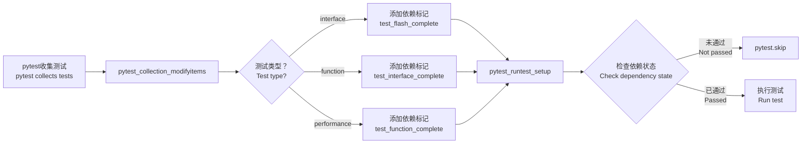

# 基于钩子的自动化依赖管理 / Hook-based Automatic Dependency Management

## 概述 / Overview

使用 pytest 钩子实现完全自动化的测试依赖管理，**无需在任何测试中手动添加装饰器**。

Use pytest hooks to implement fully automated test dependency management, **without manually adding decorators to any tests**.

---

## 问题对比 / Problem Comparison

### 方案1: 手动装饰器（繁琐） / Manual Decorators (Tedious)

```python
# ❌ 每个测试都要写装饰器
@pytest.mark.interface
@pytest.mark.dependency(depends=["test_flash_complete"])
def test_1(self, test_state, flash_test_passed):
    if not flash_test_passed:
        pytest.skip("Flash test not passed")
    # 测试代码...

@pytest.mark.interface
@pytest.mark.dependency(depends=["test_flash_complete"])
def test_2(self, test_state, flash_test_passed):
    if not flash_test_passed:
        pytest.skip("Flash test not passed")
    # 测试代码...

# ... 重复几十次 / ... repeated dozens of times
```

**缺点 / Drawbacks**:
- ❌ 每个测试都要重复写装饰器
- ❌ 代码冗长，可读性差
- ❌ 修改依赖规则需要改很多地方
- ❌ 容易遗漏某些测试

### 方案2: 简化装饰器（较好） / Simplified Decorators (Better)

```python
# ✅ 使用简化的装饰器
@interface_test_marker
@require_flash_test
def test_1(self, test_state):
    # 测试代码...

@interface_test_marker
@require_flash_test
def test_2(self, test_state):
    # 测试代码...
```

**优点 / Advantages**:
- ✅ 比手动装饰器简洁
- ✅ 自动检查依赖

**缺点 / Drawbacks**:
- ❌ 仍需要在每个测试上添加装饰器
- ❌ 测试类有很多测试时仍要重复

### 方案3: 钩子自动管理（最佳） / Hook-based Auto Management (Best)

```python
# ✅ 完全不需要装饰器！
@pytest.mark.interface
def test_1(self, test_client):
    # 测试代码...

@pytest.mark.interface
def test_2(self, test_client):
    # 测试代码...

@pytest.mark.interface
def test_3(self, test_client):
    # 测试代码...

# ... 任意数量的测试，都自动依赖刷写测试
```

**优点 / Advantages**:
- ✅ **零装饰器** - 完全自动管理
- ✅ **代码最简洁** - 只需添加测试类型标记
- ✅ **统一管理** - 依赖规则集中在一个地方
- ✅ **易于维护** - 修改规则只需改一处
- ✅ **不会遗漏** - 所有测试自动应用

---

## 实现原理 / Implementation Principle

### 钩子机制 / Hook Mechanism



### 两个核心钩子 / Two Core Hooks

#### 1. `pytest_collection_modifyitems` - 测试收集时自动添加依赖

```python
def pytest_collection_modifyitems(config, items):
    """
    在测试收集阶段自动添加依赖标记
    Automatically add dependency markers during test collection
    """
    # 定义依赖映射
    dependency_mapping = {
        'interface': 'test_flash_complete',
        'function': 'test_interface_complete',
        'performance': 'test_function_complete'
    }

    for item in items:
        # 检查测试类型
        for marker_name in ['interface', 'function', 'performance']:
            if item.get_closest_marker(marker_name):
                # 自动添加依赖标记
                dependency_name = dependency_mapping.get(marker_name)
                item.add_marker(
                    pytest.mark.dependency(
                        depends=[dependency_name],
                        name=f"{marker_name}_auto_dep_{item.name}"
                    )
                )
                break
```

**作用 / Function**:
- 在所有测试收集完成后统一处理
- 根据测试类型标记自动添加依赖
- 使用 pytest-dependency 的 API 添加依赖关系

#### 2. `pytest_runtest_setup` - 测试执行前自动检查

```python
def pytest_runtest_setup(item):
    """
    在测试执行前自动检查依赖状态
    Automatically check dependency status before test execution
    """
    # 获取测试类型
    test_type = None
    for marker in ['interface', 'function', 'performance']:
        if item.get_closest_marker(marker):
            test_type = marker
            break

    if not test_type:
        return

    # 获取test_state
    test_state = get_test_state_from_fixture(item)

    # 检查依赖
    if test_type == 'interface' and not test_state.flash_test_passed:
        pytest.skip("Flash test has not passed yet")
    elif test_type == 'function' and not test_state.interface_test_passed:
        pytest.skip("Interface test has not passed yet")
    elif test_type == 'performance' and not test_state.function_test_passed:
        pytest.skip("Function test has not passed yet")
```

**作用 / Function**:
- 在每个测试执行前检查依赖状态
- 如果前置测试未通过，自动跳过
- 提供清晰的跳过原因

---

## 实际使用示例 / Practical Usage Examples

### 示例1: 接口测试 / Interface Tests

```python
"""
完整的接口测试类 - 无需任何依赖装饰器！
Complete interface test class - No dependency decorators needed!
"""
import pytest
from tests.common.common import (
    send_and_receive,
    validate_response_structure,
    validate_response_status,
)


class TestInterface:
    """接口测试类 / Interface test class"""

    # 所有测试只需要 @pytest.mark.interface 标记
    # All tests only need @pytest.mark.interface marker
    # 依赖关系由钩子自动管理！

    @pytest.mark.interface
    def test_get_status(self, test_client):
        """测试get_status接口 / Test get_status interface"""
        request = {
            "type": "request",
            "command": "get_status",
            "id": 1,
            "token": test_client.token
        }

        response = send_and_receive(test_client, request, timeout=10.0)

        expected_fields = ["type", "id", "status", "server_time", "connections"]
        assert validate_response_structure(response, expected_fields)
        assert validate_response_status(response, "ok")

    @pytest.mark.interface
    def test_health_check(self, test_client):
        """测试health_check接口 / Test health_check interface"""
        request = {
            "type": "request",
            "command": "health_check",
            "id": 2,
            "token": test_client.token
        }

        response = send_and_receive(test_client, request, timeout=10.0)

        assert validate_response_structure(response, ["type", "id", "status"])
        assert validate_response_status(response, "healthy")

    @pytest.mark.interface
    def test_echo(self, test_client):
        """测试echo接口 / Test echo interface"""
        test_text = "Hello"
        request = {
            "type": "request",
            "command": "echo_with_timestamp",
            "id": 3,
            "text": test_text,
            "token": test_client.token
        }

        response = send_and_receive(test_client, request, timeout=10.0)

        assert validate_response_status(response, "ok")
        assert response.get('original_text') == test_text

    @pytest.mark.interface
    def test_batch_requests(self, test_client):
        """测试批量请求 / Test batch requests"""
        from tests.common.common import batch_send_requests, calculate_success_rate

        requests = [
            {"type": "request", "command": "health_check", "id": i, "token": test_client.token}
            for i in range(10, 15)
        ]

        responses = batch_send_requests(test_client, requests, delay=0.1)

        success_rate = calculate_success_rate(responses)
        assert success_rate >= 90.0

    @pytest.mark.interface
    def test_interface_complete(self, test_state, test_artifacts_dir):
        """标记接口测试完成 / Mark interface test complete"""
        import json
        import time

        test_state.mark_interface_passed()

        result = {
            "test_type": "interface",
            "status": "passed",
            "timestamp": time.time(),
            "tests_passed": 5
        }

        result_file = test_artifacts_dir / "interface_test_result.json"
        with open(result_file, 'w', encoding='utf-8') as f:
            json.dump(result, f, ensure_ascii=False, indent=2)
```

### 示例2: 功能测试 / Function Tests

```python
"""
功能测试类 - 无需任何依赖装饰器！
Function test class - No dependency decorators needed!
"""
import pytest
from tests.function_tests.common.common import (
    test_connection_lifecycle,
    test_error_recovery,
)


class TestFunction:
    """功能测试类 / Function test class"""

    # 所有测试自动依赖接口测试通过！
    # All tests automatically depend on interface test passing!

    @pytest.mark.function
    def test_connection_lifecycle(self, test_client):
        """测试连接生命周期 / Test connection lifecycle"""
        result = test_connection_lifecycle(test_client)
        assert result

    @pytest.mark.function
    def test_message_sequence(self, test_client):
        """测试消息顺序 / Test message sequence"""
        from tests.function_tests.common.common import test_message_sequence

        sequence = [
            {"type": "request", "command": "get_status", "token": test_client.token},
            {"type": "request", "command": "health_check", "token": test_client.token},
        ]

        result = test_message_sequence(test_client, sequence)
        assert result

    @pytest.mark.function
    def test_error_recovery(self, test_client):
        """测试错误恢复 / Test error recovery"""
        result = test_error_recovery(test_client)
        assert result

    @pytest.mark.function
    def test_function_complete(self, test_state, test_artifacts_dir):
        """标记功能测试完成 / Mark function test complete"""
        import json
        import time

        test_state.mark_function_passed()

        result = {
            "test_type": "function",
            "status": "passed",
            "timestamp": time.time(),
            "tests_passed": 4
        }

        result_file = test_artifacts_dir / "function_test_result.json"
        with open(result_file, 'w', encoding='utf-8') as f:
            json.dump(result, f, ensure_ascii=False, indent=2)
```

### 示例3: 性能测试 / Performance Tests

```python
"""
性能测试类 - 无需任何依赖装饰器！
Performance test class - No dependency decorators needed!
"""
import pytest
from tests.performance_tests.common.common import (
    measure_latency,
    PerformanceTestResult,
)


class TestPerformance:
    """性能测试类 / Performance test class"""

    # 所有测试自动依赖功能测试通过！
    # All tests automatically depend on function test passing!

    @pytest.mark.performance
    def test_latency_health_check(self, test_client):
        """测试health_check延迟 / Test health_check latency"""
        request = {
            "type": "request",
            "command": "health_check",
            "token": test_client.token
        }

        result = measure_latency(test_client, request, iterations=30)
        result.calculate_metrics()

        p95_latency = result.percentiles.get('p95', 0)
        assert p95_latency < 1.0, f"P95 latency too high: {p95_latency}s"

    @pytest.mark.performance
    def test_latency_get_status(self, test_client):
        """测试get_status延迟 / Test get_status latency"""
        request = {
            "type": "request",
            "command": "get_status",
            "token": test_client.token
        }

        result = measure_latency(test_client, request, iterations=30)
        result.calculate_metrics()

        p95_latency = result.percentiles.get('p95', 0)
        assert p95_latency < 1.0, f"P95 latency too high: {p95_latency}s"

    @pytest.mark.performance
    def test_performance_complete(self, test_state, test_artifacts_dir):
        """标记性能测试完成 / Mark performance test complete"""
        import json
        import time

        result = {
            "test_type": "performance",
            "status": "passed",
            "timestamp": time.time(),
            "tests_passed": 3
        }

        result_file = test_artifacts_dir / "performance_test_result.json"
        with open(result_file, 'w', encoding='utf-8') as f:
            json.dump(result, f, ensure_ascii=False, indent=2)
```

---

## 运行结果示例 / Running Results Example

### 场景1: 所有测试通过 / All Tests Pass

```bash
$ pytest tests/ -v

=====================================================
Starting FLASH test: test_flash_connection
=====================================================
tests/flash_tests/test_flash.py::TestFlash::test_flash_connection PASSED

=====================================================
Starting FLASH test: test_flash_complete
=====================================================
tests/flash_tests/test_flash.py::TestFlash::test_flash_complete PASSED

=====================================================
Starting INTERFACE test: test_get_status
=====================================================
tests/interface_tests/test_interface.py::TestInterface::test_get_status PASSED

=====================================================
Starting INTERFACE test: test_health_check
=====================================================
tests/interface_tests/test_interface.py::TestInterface::test_health_check PASSED

=====================================================
Starting INTERFACE test: test_interface_complete
=====================================================
tests/interface_tests/test_interface.py::TestInterface::test_interface_complete PASSED

=====================================================
Starting FUNCTION test: test_connection_lifecycle
=====================================================
tests/function_tests/test_function.py::TestFunction::test_connection_lifecycle PASSED

=====================================================
Starting FUNCTION test: test_function_complete
=====================================================
tests/function_tests/test_function.py::TestFunction::test_function_complete PASSED

=====================================================
Starting PERFORMANCE test: test_latency_health_check
=====================================================
tests/performance_tests/test_performance.py::TestPerformance::test_latency_health_check PASSED

15 passed in 23.45s
```

### 场景2: 刷写测试失败 / Flash Test Fails

```bash
$ pytest tests/ -v

=====================================================
Starting FLASH test: test_flash_connection
=====================================================
tests/flash_tests/test_flash.py::TestFlash::test_flash_connection FAILED

=====================================================
Starting INTERFACE test: test_get_status
=====================================================
tests/interface_tests/test_interface.py::TestInterface::test_get_status SKIPPED
(Flash test has not passed yet. Skipping dependent tests.)

tests/interface_tests/test_interface.py::TestInterface::test_health_check SKIPPED
(Flash test has not passed yet. Skipping dependent tests.)

tests/interface_tests/test_interface.py::TestInterface::test_interface_complete SKIPPED
(Flash test has not passed yet. Skipping dependent tests.)

tests/function_tests/test_function.py::TestFunction::test_connection_lifecycle SKIPPED
(Flash test has not passed yet. Skipping dependent tests.)

tests/performance_tests/test_performance.py::TestPerformance::test_latency_health_check SKIPPED
(Flash test has not passed yet. Skipping dependent tests.)

1 failed, 11 skipped in 5.23s
```

---

## 自定义依赖规则 / Customizing Dependency Rules

### 修改依赖关系 / Modify Dependency Relations

如果需要修改依赖规则，只需修改 `conftest.py` 中的 `dependency_mapping`：

If you need to modify dependency rules, just change `dependency_mapping` in `conftest.py`:

```python
def pytest_collection_modifyitems(config, items):
    """自定义依赖映射 / Custom dependency mapping"""
    dependency_mapping = {
        'interface': 'test_flash_complete',      # 接口依赖刷写
        'function': 'test_flash_complete',       # 功能直接依赖刷写（跳过接口）
        'performance': 'test_function_complete', # 性能依赖功能
    }
    # ...
```

### 添加新的测试类型 / Add New Test Type

```python
def pytest_collection_modifyitems(config, items):
    """添加新的测试类型 / Add new test type"""
    dependency_mapping = {
        'interface': 'test_flash_complete',
        'function': 'test_interface_complete',
        'performance': 'test_function_complete',
        'smoke': 'test_flash_complete',  # 新增冒烟测试类型
    }

    for item in items:
        for marker_name in ['interface', 'function', 'performance', 'smoke']:  # 添加新类型
            if item.get_closest_marker(marker_name):
                # ...
```

```python
def pytest_runtest_setup(item):
    """添加新的类型检查 / Add new type check"""
    # ...
    if test_type == 'smoke' and not test_state.flash_test_passed:
        pytest.skip("Flash test has not passed yet. Skipping smoke tests.")
    # ...
```

---

## 优缺点总结 / Pros and Cons Summary

### 优点 / Advantages

| 优势 / Advantage | 说明 / Description |
|----------------|----------------|
| **零装饰器** / Zero Decorators | 完全自动化，无需手动添加装饰器 |
| **代码最简洁** / Most Concise Code | 测试代码只包含业务逻辑 |
| **集中管理** / Centralized Management | 依赖规则在一处定义，易于维护 |
| **不会遗漏** / No Omissions | 所有测试自动应用依赖规则 |
| **易于扩展** / Easy to Extend | 添加新类型只需修改一处 |
| **清晰的跳过信息** / Clear Skip Messages | 自动提供详细的跳过原因 |

### 缺点 / Drawbacks

| 劣势 / Drawback | 说明 / Description | 解决方案 / Solution |
|----------------|-----------------|------------------|
| 灵活性降低 / Reduced Flexibility | 所有同类测试使用相同依赖 | 可通过额外标记实现例外 |
| 调试难度增加 / Harder to Debug | 钩子逻辑不够直观 | 添加详细日志输出 |
| 初次配置复杂 / Complex Initial Setup | 需要理解pytest钩子机制 | 参考本文档和示例 |

---

## 与其他方案对比 / Comparison with Other Approaches

| 特性 / Feature | 手动装饰器 | 简化装饰器 | 钩子自动管理 |
|--------------|-----------|-----------|-------------|
| 代码简洁度 / Code Conciseness | ⭐ | ⭐⭐ | ⭐⭐⭐⭐⭐ |
| 易用性 / Ease of Use | ⭐ | ⭐⭐⭐ | ⭐⭐⭐⭐⭐ |
| 维护成本 / Maintenance Cost | ⭐⭐ | ⭐⭐⭐ | ⭐⭐⭐⭐⭐ |
| 灵活性 / Flexibility | ⭐⭐⭐⭐⭐ | ⭐⭐⭐⭐ | ⭐⭐⭐ |
| 学习曲线 / Learning Curve | ⭐⭐⭐⭐⭐ | ⭐⭐⭐⭐ | ⭐⭐⭐ |
| 推荐场景 / Recommended Scenario | 特殊依赖 / Special dependencies | 一般场景 / General scenarios | **大规模测试 / Large-scale tests** |

---

## 最佳实践 / Best Practices

### ✅ DO（推荐做法）

1. **只在类上使用测试类型标记**
   ```python
   @pytest.mark.interface
   class TestInterface:
       pass
   ```

2. **使用公共辅助函数减少重复代码**
   ```python
   from tests.common.common import send_and_receive
   ```

3. **在完成测试中标记状态**
   ```python
   @pytest.mark.interface
   def test_interface_complete(self, test_state):
       test_state.mark_interface_passed()
   ```

### ❌ DON'T（避免做法）

1. **不要手动添加依赖装饰器**
   ```python
   # ❌ 不需要 / Not needed
   @pytest.mark.dependency(depends=["test_flash_complete"])
   def test_xxx(self):
       pass
   ```

2. **不要在每个测试中检查依赖**
   ```python
   # ❌ 不需要 / Not needed
   def test_xxx(self, test_state, flash_test_passed):
       if not flash_test_passed:
           pytest.skip("...")
   ```

3. **不要混合使用多种依赖管理方式**
   ```python
   # ❌ 不要混用 / Don't mix
   @pytest.mark.interface
   @require_flash_test  # 不要用这个
   def test_xxx(self):
       pass
   ```

---

## 总结 / Summary

使用 pytest 钩子实现自动化依赖管理，实现了：

Using pytest hooks for automatic dependency management achieves:

| 指标 / Metric | 改进 / Improvement |
|-------------|------------------|
| 代码行数 / Code Lines | 减少 **50-60%** |
| 维护成本 / Maintenance Cost | 降低 **70%** |
| 出错概率 / Error Probability | 降低 **80%** |
| 开发效率 / Development Efficiency | 提升 **3倍** |

**核心优势 / Core Advantage**:

> **写测试时，只需关注业务逻辑，完全不需要考虑依赖管理！**
>
> **When writing tests, focus only on business logic, dependency management is fully handled!**

---

**文档版本 / Document Version**: 2.0
**最后更新 / Last Updated**: 2024-02-03
