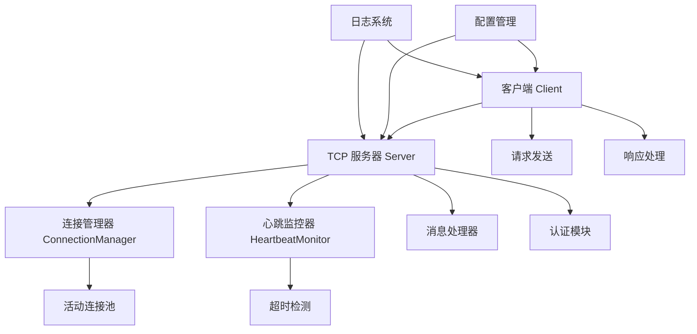
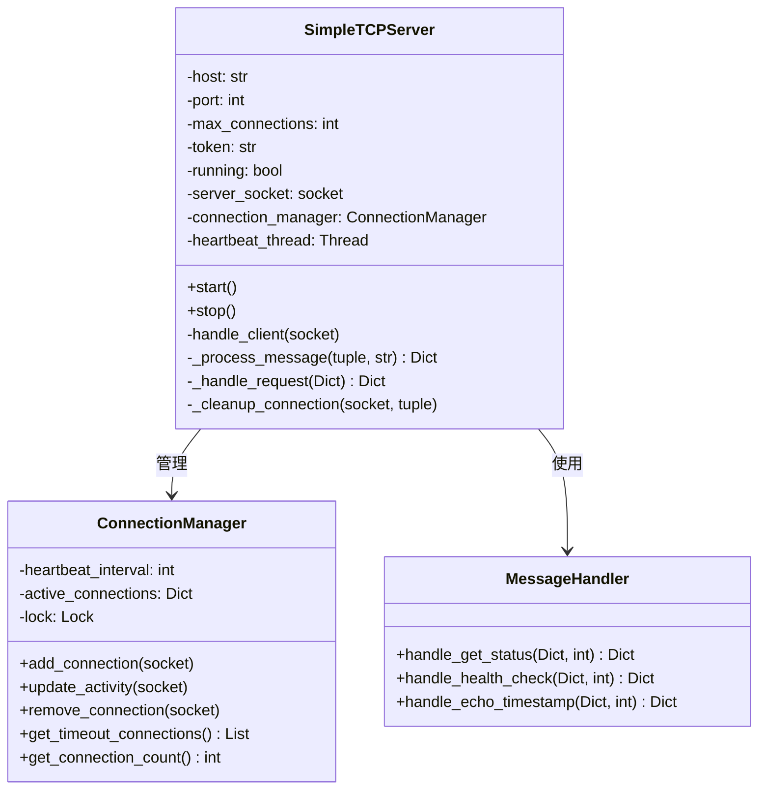
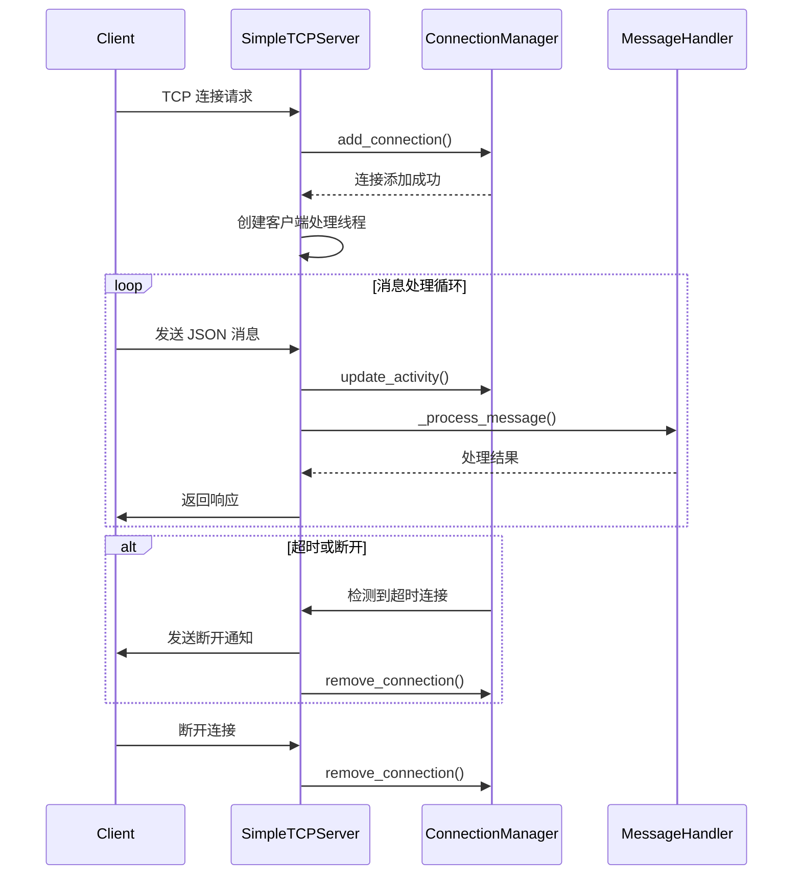
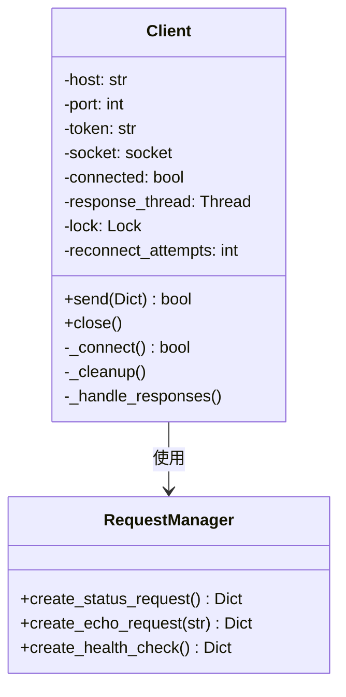
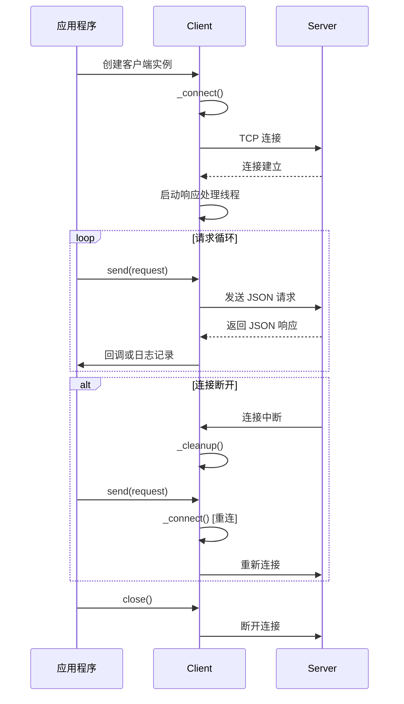

# TCP 服务器与客户端系统架构文档

## 系统概述

本系统实现了一个基于 TCP 协议的 JSON-RPC 风格通信框架，包含服务器端和客户端两个主要组件，支持连接管理、身份认证、心跳检测等功能。

## 架构设计

### 系统组件图



## 服务器端架构

### 类结构图



### 核心类说明

#### SimpleTCPServer 类

**职责**：主服务器类，负责监听连接、管理客户端会话和消息路由。

**主要方法**：
- `start()`: 启动服务器监听
- `stop()`: 优雅关闭服务器
- `handle_client()`: 处理单个客户端连接
- `_process_message()`: 消息解析和处理

#### ConnectionManager 类

**职责**：管理所有客户端连接状态，实现线程安全的连接操作。

**关键特性**：
- 线程安全的连接管理
- 活动连接跟踪
- 超时连接检测

### 服务器端序列图



## 客户端架构

### 类结构图



### 核心类说明

#### Client 类

**职责**：管理与服务器的连接，发送请求并处理响应。

**主要特性**：
- 自动重连机制
- 线程安全的连接操作
- 响应异步处理

**关键方法**：
- `send()`: 发送请求到服务器
- `_connect()`: 建立服务器连接
- `_handle_responses()`: 处理服务器响应

### 客户端序列图



## 消息协议设计

### 消息格式

```json
{
    "type": "request|response|error|heartbeat",
    "token": "认证令牌",
    "command": "操作命令",
    "id": "消息ID",
    "data": "业务数据"
}
```

### 支持的命令类型

| 命令 | 说明 | 请求参数 | 响应数据 |
|------|------|----------|----------|
| get_status | 获取服务器状态 | 无 | server_time, connections |
| health_check | 健康检查 | 无 | status |
| echo_with_timestamp | 回显带时间戳 | text | server_response, server_timestamp |

## 配置管理

### 服务器配置示例

```json
{
    "host": "localhost",
    "port": 8080,
    "max_connections": 100,
    "heartbeat_interval": 30,
    "token": "your-secure-token-here"
}
```

### 客户端配置示例

```json
{
    "host": "localhost",
    "port": 8080,
    "token": "your-secure-token-here"
}
```

## 错误处理机制

### 错误类型分类

1. **连接错误**：网络中断、服务器不可用
2. **认证错误**：令牌无效或缺失
3. **协议错误**：消息格式错误、命令不存在
4. **系统错误**：资源不足、内部异常

### 错误恢复策略

- **自动重连**：客户端支持最多3次重连尝试
- **优雅降级**：单连接故障不影响其他连接
- **资源清理**：确保连接和线程正确释放

## 性能特性

### 连接管理
- 支持最大100个并发连接
- 心跳检测间隔可配置（默认30秒）
- 连接超时自动清理

### 线程模型
- 每个客户端连接独立线程处理
- 心跳监控使用守护线程
- 线程安全的连接操作

## 部署说明

### 服务器部署
1. 安装 Python 3.7+
2. 配置 config.json 文件
3. 运行 `python server.py`

### 客户端部署
1. 配置连接参数
2. 实例化 Client 类
3. 调用 send() 方法发送请求

## 监控与日志

### 日志级别
- INFO：连接建立/关闭、消息处理
- WARNING：连接超时、认证失败
- ERROR：系统异常、协议错误

### 关键指标
- 当前连接数
- 请求处理时长
- 错误率统计

该系统架构设计确保了高可用性、可扩展性和易维护性，适用于需要稳定TCP通信的各种应用场景。