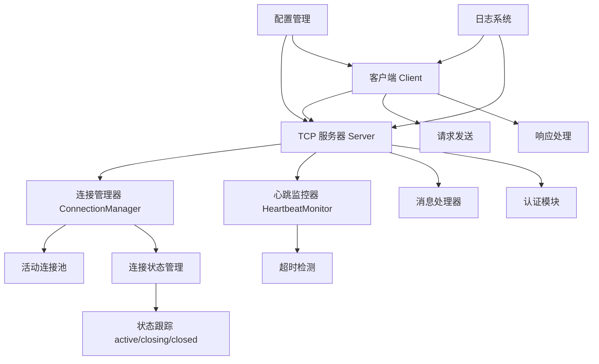
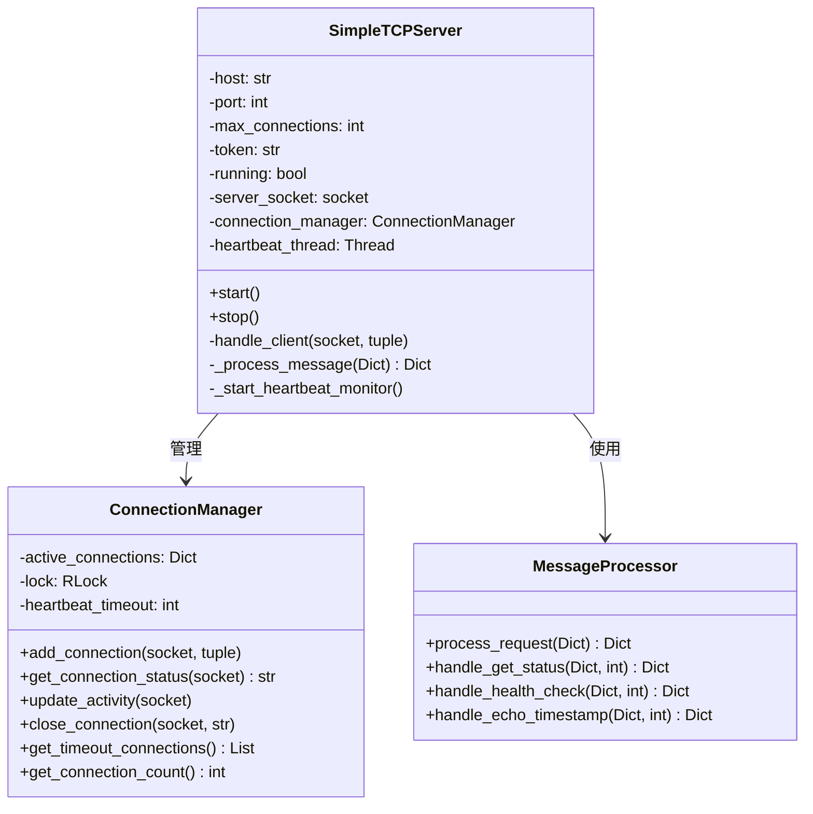
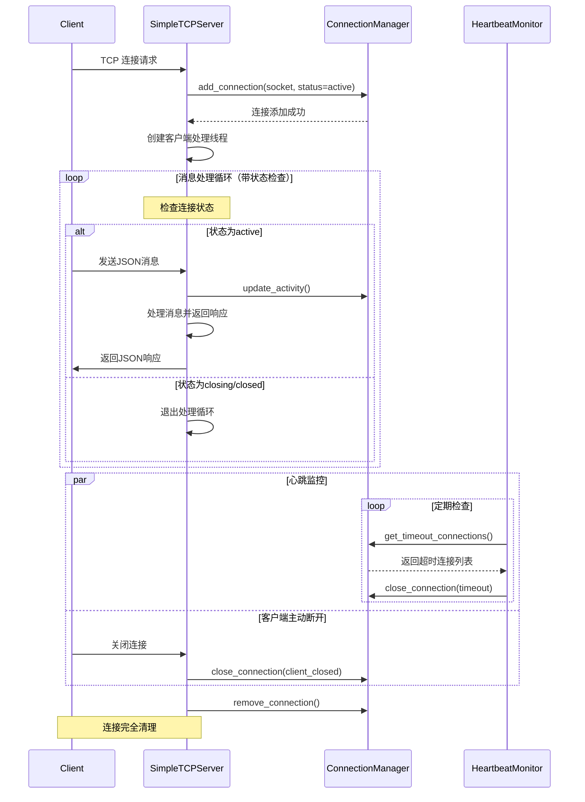
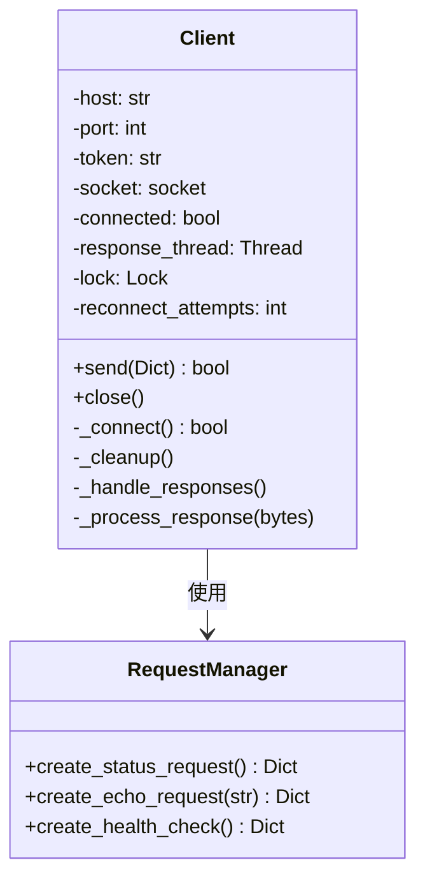
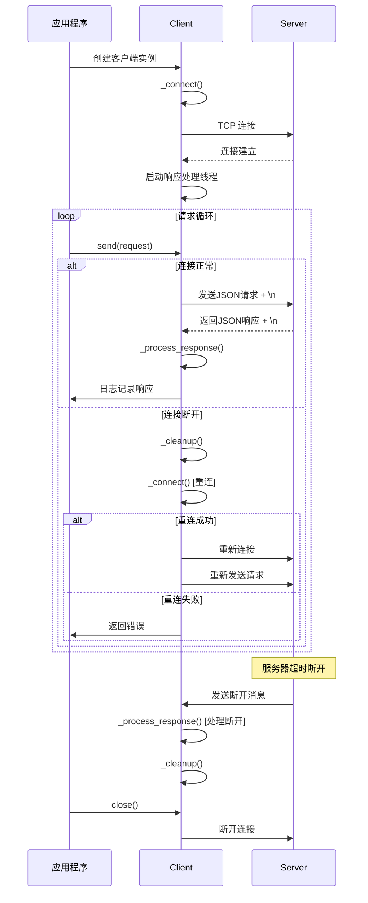
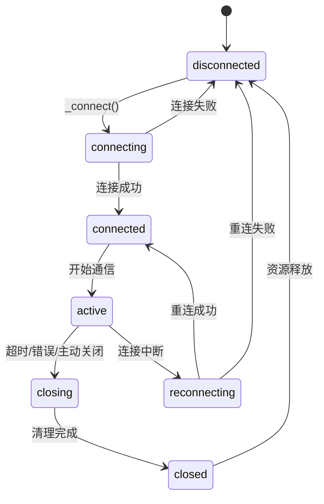

# TCP 服务器与客户端系统架构文档（更新版）

## 系统概述

本系统实现了一个基于 TCP 协议的 JSON-RPC 风格通信框架，包含服务器端和客户端两个主要组件。经过优化后，系统解决了连接状态管理和竞态条件问题，提供了更稳定的通信机制。

## 架构设计

### 系统组件图



## 服务器端架构（优化版）

### 类结构图



### 核心类说明

#### SimpleTCPServer 类

**职责**：主服务器类，负责监听连接、管理客户端会话和消息路由。

**主要方法**：
- `start()`: 启动服务器监听
- `stop()`: 优雅关闭服务器
- `handle_client()`: 处理单个客户端连接（已优化状态检查）
- `_process_message()`: 消息解析和处理

**关键优化**：
- 添加连接状态检查循环条件
- 使用短超时接收，及时检查连接状态
- 完善的异常分类处理

#### ConnectionManager 类

**职责**：管理所有客户端连接状态，实现线程安全的连接操作。

**关键特性**：
- 线程安全的连接管理（使用RLock）
- 连接状态跟踪（active/closing/closed）
- 原子操作连接关闭

**新增方法**：
- `get_connection_status()`: 获取连接状态
- `close_connection()`: 安全关闭连接

### 服务器端序列图（优化版）



## 客户端架构（优化版）

### 类结构图



### 核心类说明

#### Client 类

**职责**：管理与服务器的连接，发送请求并处理响应。

**主要特性**：
- 自动重连机制（带指数退避）
- 消息边界处理（换行符分隔）
- 响应异步处理

**关键优化**：
- 改进的重连逻辑
- 消息边界处理
- 更好的异常分类

**关键方法**：
- `send()`: 发送请求到服务器（带自动重连）
- `_connect()`: 建立服务器连接
- `_handle_responses()`: 处理服务器响应（使用消息边界）

### 客户端序列图（优化版）



## 消息协议设计

### 消息格式

```json
{
    "type": "request|response|error|heartbeat",
    "token": "认证令牌",
    "command": "操作命令",
    "id": "消息ID",
    "data": "业务数据"
}
```

### 支持的命令类型

| 命令 | 说明 | 请求参数 | 响应数据 |
|------|------|----------|----------|
| get_status | 获取服务器状态 | 无 | server_time, connections |
| health_check | 健康检查 | 无 | status |
| echo_with_timestamp | 回显带时间戳 | text | server_response, server_timestamp |

### 消息边界处理

**优化前**：原始TCP流，可能发生粘包
**优化后**：使用换行符(`\n`)作为消息分隔符

```python
# 客户端发送
message = json.dumps(request) + '\n'

# 服务器接收处理
while b'\n' in buffer:
    line, buffer = buffer.split(b'\n', 1)
    if line:
        process_message(line)
```

## 连接状态管理

### 状态机设计



### 状态说明

1. **disconnected**：未连接状态
2. **connecting**：连接建立中
3. **connected**：连接已建立，可通信
4. **active**：活跃通信状态
5. **closing**：关闭中状态（防止重复操作）
6. **closed**：已关闭状态
7. **reconnecting**：重连中状态

## 错误处理机制

### 错误分类与处理策略

| 错误类型 | 原因 | 处理策略 |
|----------|------|----------|
| 连接错误 | 网络中断、服务器不可用 | 自动重连（指数退避） |
| 认证错误 | 令牌无效或缺失 | 返回错误，不断开连接 |
| 协议错误 | 消息格式错误、命令不存在 | 返回错误说明，保持连接 |
| 超时错误 | 心跳超时、响应超时 | 服务器主动断开，客户端重连 |
| 系统错误 | 资源不足、内部异常 | 记录日志，优雅降级 |

### 重连机制（指数退避算法）

```python
reconnect_delay = base_delay * (2 ** (attempt_number - 1))
```

示例：基础延迟2秒，重试3次
- 第1次重试：等待 2 * (2^0) = 2秒
- 第2次重试：等待 2 * (2^1) = 4秒  
- 第3次重试：等待 2 * (2^2) = 8秒

## 配置管理

### 服务器配置示例

```json
{
    "host": "localhost",
    "port": 8080,
    "max_connections": 100,
    "heartbeat_interval": 5,
    "token": "your-secure-token-here"
}
```

### 客户端配置示例

```json
{
    "host": "localhost",
    "port": 8080,
    "token": "your-secure-token-here"
}
```

## 性能特性

### 连接管理
- 支持最大100个并发连接
- 心跳检测间隔可配置（默认5秒）
- 连接超时自动清理

### 线程模型
- 每个客户端连接独立线程处理
- 心跳监控使用守护线程
- 使用RLock确保线程安全

## 监控与日志

### 日志级别
- INFO：连接建立/关闭、消息处理
- WARNING：连接超时、认证失败
- ERROR：系统异常、协议错误
- DEBUG：详细状态跟踪（连接状态变化）

### 关键指标
- 当前连接数
- 请求处理时长
- 错误率统计
- 重连次数统计

## 部署说明

### 服务器部署
1. 安装 Python 3.7+
2. 配置 config.json 文件
3. 运行 `python server.py`

### 客户端部署
1. 配置连接参数
2. 实例化 Client 类
3. 调用 send() 方法发送请求

## 关键优化总结

### 解决的问题
1. **竞态条件**：通过连接状态管理避免多个线程同时操作同一连接
2. **消息边界**：使用换行符分隔解决TCP粘包问题
3. **资源泄漏**：完善的finally块确保资源正确释放
4. **错误恢复**：自动重连机制提高系统容错性

### 架构优势
1. **高可用性**：自动重连和状态管理确保服务持续可用
2. **可扩展性**：模块化设计便于功能扩展
3. **可维护性**：清晰的日志和错误处理便于问题定位
4. **性能优化**：短超时检查和状态跟踪减少无效操作

该系统架构经过优化后，提供了稳定可靠的TCP通信基础，适用于需要长连接管理的各种应用场景。